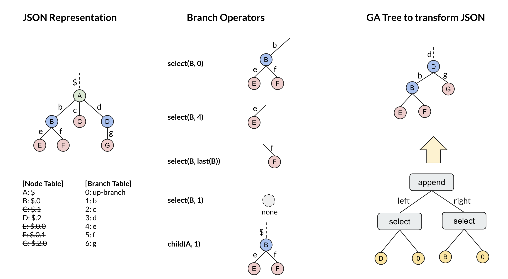
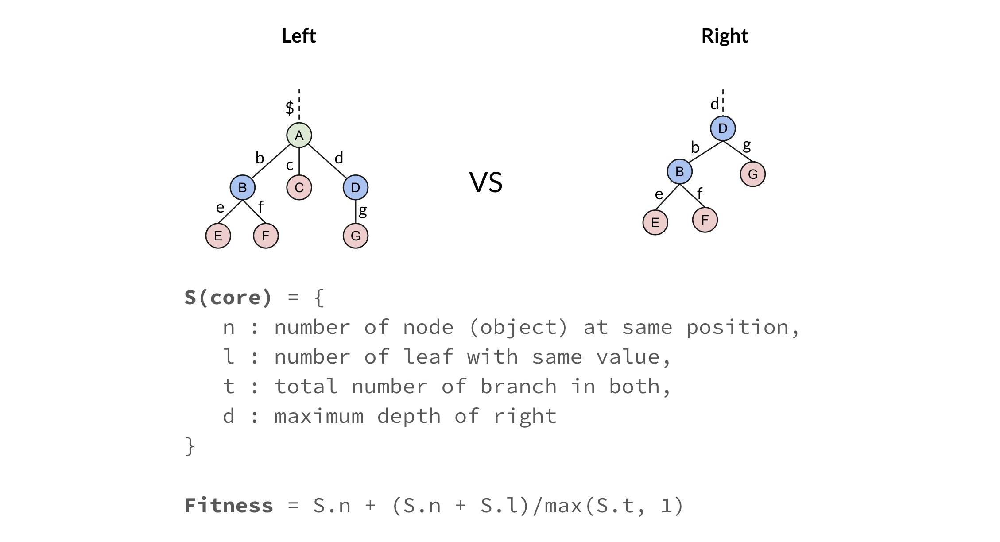

# jsont

json transformer by using GP Tree operators.


## Development

- this project is based on [deap](https://github.com/DEAP/deap) python project.

### Installation

- should install `deap` packages before to run. (see [README](../README.md))

```sh
# required to run once.
$ python setup.py install
```

### Run Self-Test

- execute unittest w/ stdout by `nose`.

```sh
$ cd jsont
$ python runtests.py -s
```

- if like to run in watch mode.

```sh
$ pip install pytest-watch
$ ptw
```

### Run Sample

- execute in python (requires ver 3.x)

```sh
$ cd jsont
$ python -m gp.op
```


## Tree Operation

- representation of JSON tree, and operators.




- fitness of JSON




